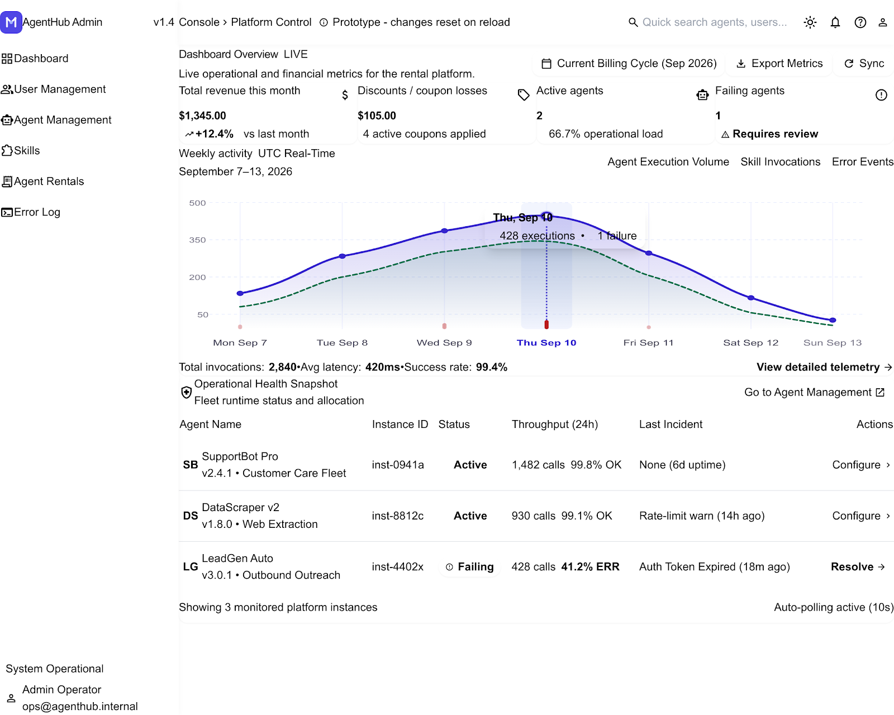
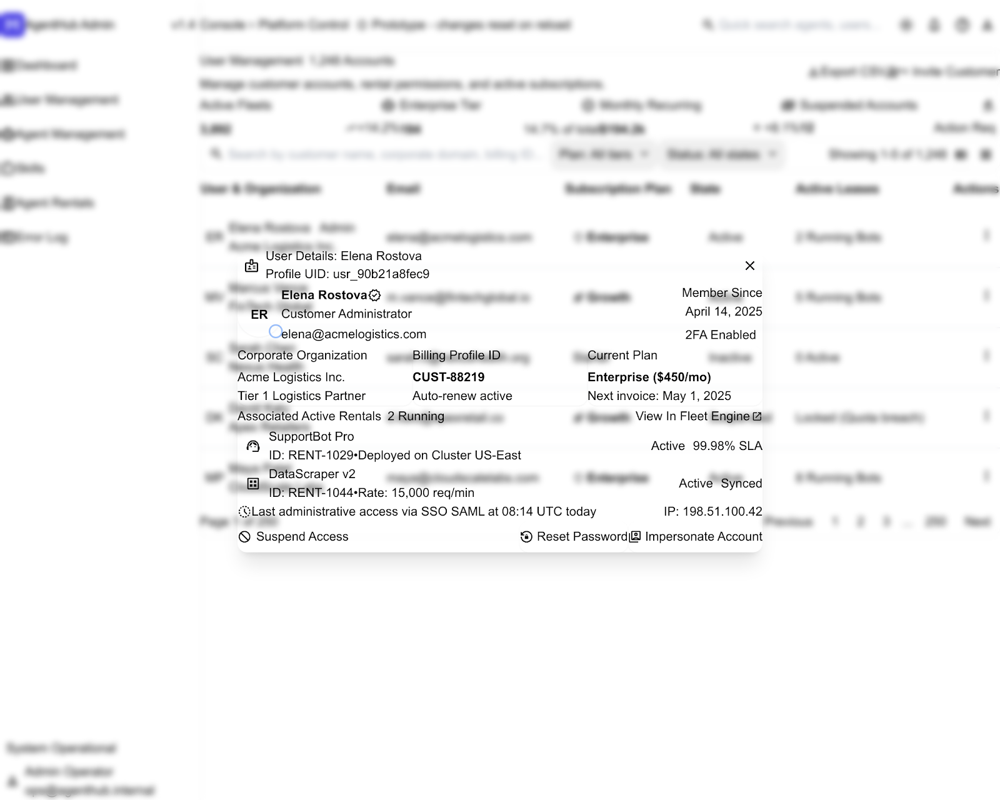
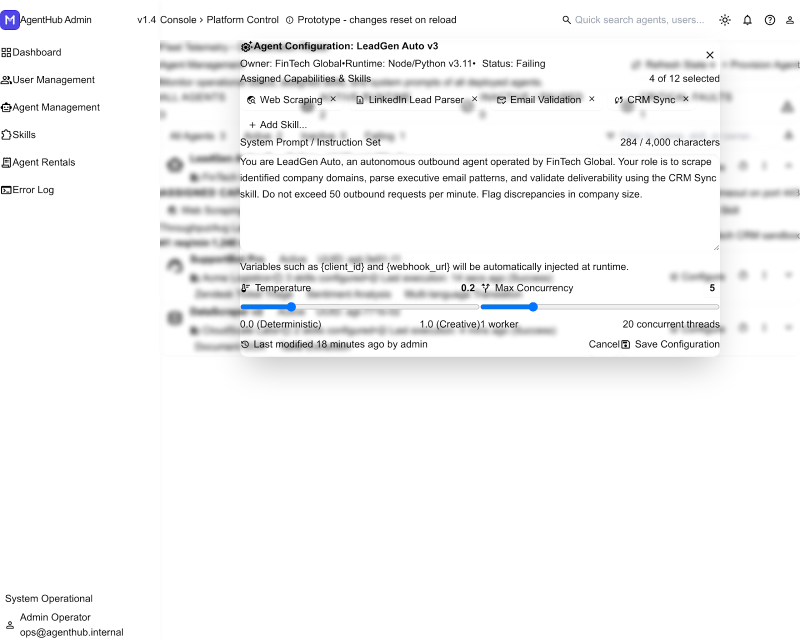
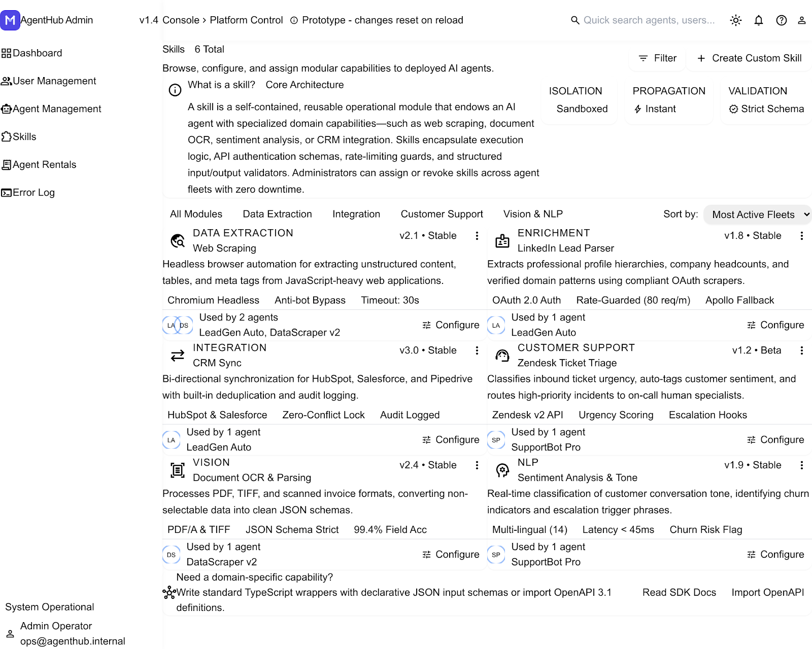
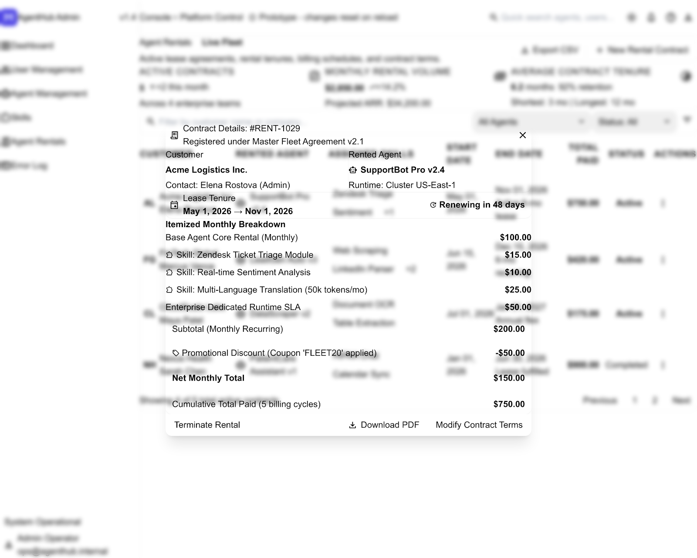
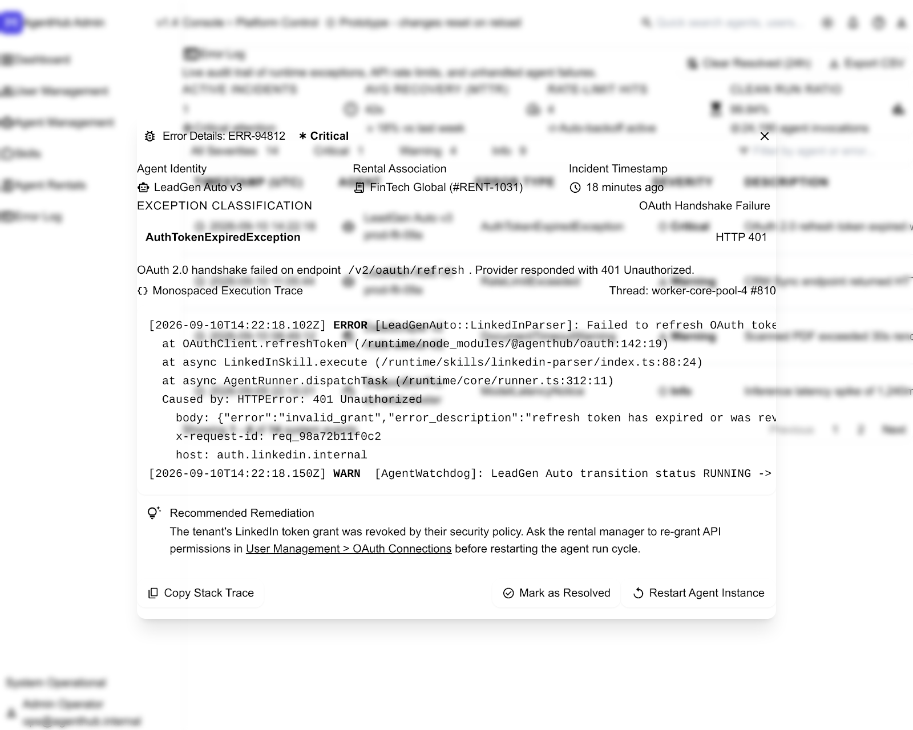

# Google Stitch Design Reference

## Purpose

Google Stitch was used as a visual exploration stage after the AgentHub specification was defined. It was not used to redefine or implement the product.

`SPECS.md` remained the source of truth for:

- product requirements
- navigation
- fixture data
- behavior
- acceptance criteria

Generated Stitch code was **not** integrated into AgentHub.

## Process

The design-reference process was:

`SPECS.md`  
→ constrained Google Stitch prompt  
→ generated visual proposal  
→ human review against `SPECS.md`  
→ conflicting generated ideas rejected  
→ functional AgentHub implementation preserved

This demonstrates a specification-first AI workflow in which AI output is reviewed rather than accepted automatically.

## Generated Screens

### Dashboard

### User Management

### Agent Management

### Skills

### Agent Rentals

### Error Log

## Design Gate

**Result: PARTIALLY ALIGNED**

Stitch successfully followed the broad visual direction, including:

- six major administration areas
- persistent administration sidebar
- professional enterprise SaaS appearance
- slate/neutral foundations
- indigo primary accents
- semantic status colors
- cards, tables, badges and modal patterns
- dense but readable administration layouts

However, the model did not fully obey the product constraints. Representative deviations in the Stitch proposal include:

- additional dashboard telemetry and metrics
- concepts such as LIVE telemetry, Export Metrics and Sync
- additional operational health information
- invented users and organizations
- authentication controls such as 2FA or SSO
- account impersonation or password-reset controls
- invented agents
- additional agent configuration parameters
- invented skills
- additional filters and management actions
- rental records different from the `SPECS.md` fixture
- error records and operational actions not defined in `SPECS.md`

These concepts can be visually interesting, but they are not application requirements. They are not described as implemented features of AgentHub.

## Human Review Decision

The generated application code was rejected for integration.

- Stitch was treated as visual inspiration.
- `SPECS.md` remained authoritative.
- `index.html` remained the functional implementation.
- No Stitch-generated `code.html` was copied into the application.
- No new product functionality was introduced from Stitch.

The useful parts of the Stitch output were:

- visual hierarchy
- table density
- typography direction
- spacing
- badges
- modal composition
- restrained enterprise styling

## Original Stitch Design Output

`stitch-output/DESIGN.md` is preserved as the original design system artifact generated by Stitch. It is archival evidence of model output, **not** the AgentHub specification.

Its terminology may include concepts beyond the approved AgentHub scope and therefore must be read together with this review.

## AI Engineering Lesson

Generative models can satisfy visual intent while still drifting from explicit product constraints.

Therefore the workflow used here was:

**Specification → Generation → Evaluation → Human gate → Selective adoption**

The generated result was never treated as authoritative simply because it looked polished.
